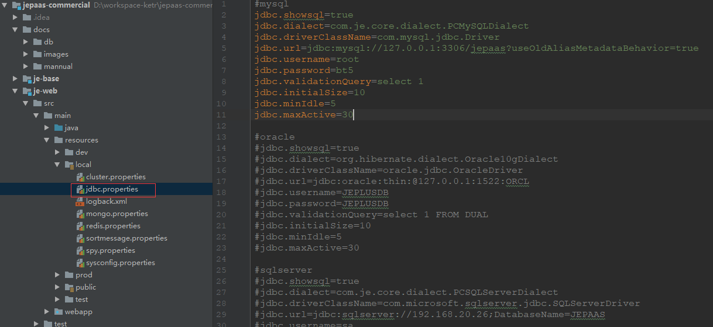
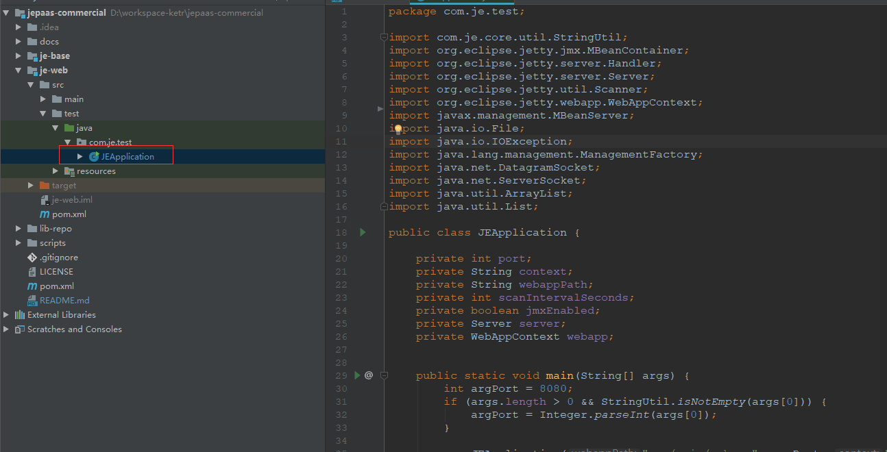
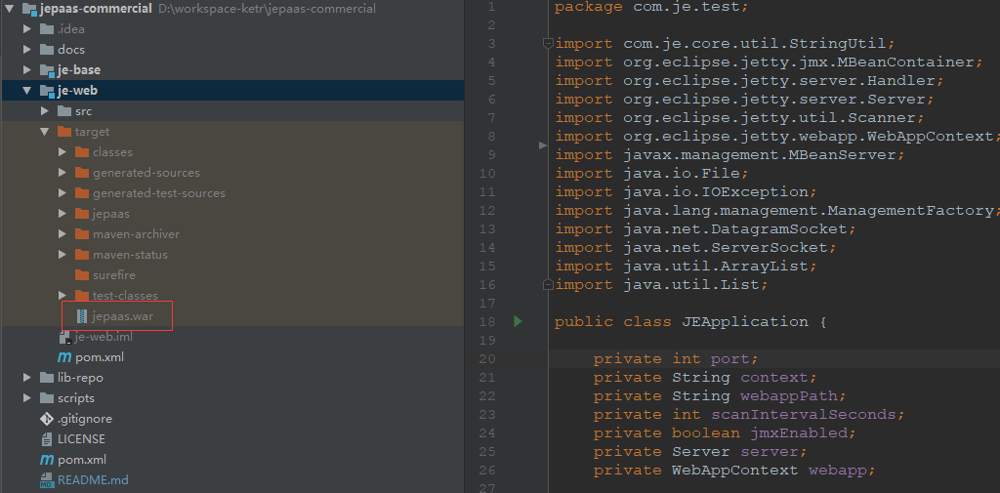

JEPAAS 7.0.0 - [官方主页](http://jepaas.com/)
=========================

## 项目简介

**JEPAAS低代码开发平台**`开源版` 让软件开发人员和业务用户通过直观的可视化界面来构建应用程序
，而不是传统的编写代码方式。
用户可以在开发平台灵活各个图形化控件，以构建业务流程、逻辑和数据模型等所需的功能，必要时还可以添加自己的代码。

## 功能特性(开源版本)

- 低代码开发平台
- 列表设计
- 表单设计
- 推送服务

## 系统演示

- [演示系统](http://example.jepaas.com)
- 默认用户名：admin
- 默认密码：123

## 环境依赖

* 使用jdk1.8
* 项目采用maven管理jar包和构建项目
  
    > 请安装maven (http://maven.apache.org/download.cgi)
  
    > 具体使用请参考[maven-基础](docs/mannual/maven-基础.md)
  
- 本项目使用redis做缓存，请安装redis
- 使用mysql5.7, 请安装mysql

## 上手指南

- [创建数据库](docs/mannual/MySQL初始化手册.md)
- 修改相应环境jdbc.properties的配置，dev: 开发环境， local: 本地开发环境， test: 测试环境， prod: 生产环境
    
        
    
- 使用[Intellij IDEA 导入maven项目](docs/mannual/idea-maven.md)
- 执行 scripts/Redis-x64-3.2.100/start.bat
- 执行 scripts/push/启动instant-push-server服务.bat
- 执行 scripts/push/启动connector-server服务.bat


- 开发阶段，可以使用je-platform-deploy/src/test/下的**com.je.te
st.JEApplication**启动(内嵌jetty应用服务器)。



## 项目目录结构描述
```
│ jepaas
├─docs jepaas文档目录
│  ├─db    数据库文档目录
│  └─mannual    用户操作手册
├─je-base jepaas开源子模块
│  ├─src  je-base源码目录
│    └─main
│        └─java
├─je-web jepaas web目录
│  ├─src jepaas源码目录
│    ├─main
│    │  ├─java                  
│    │  ├─resources jepaas Web项目资源文件
│    │  │  ├─dev    开发环境
│    │  │  ├─local  本地环境
│    │  │  ├─prod   生产环境
│    │  │  ├─public 公共配置资源
│    │  │  └─test   测试环境
│    │  └─webapp    Web前端及资源目录
│    │      ├─JE          
│    │      ├─plugin    插件目录               
│    │      ├─pro       项目目录           
│    │      ├─static    静态资源              
│    │      └─WEB-INF
│    └─test Web项目启动器及单元测试目录      
├─lib-repo  JEPaaS依赖私有资源包
└─scripts   JEPaaS脚本及依赖项目目录
    ├─db-migration  JEPaaS数据库脚本目录，包括jepaas.sql和instant.sql
    ├─push  JEPaaS推送项目
    │  ├─connector-server-1.0.0.RELEASE JEPaaS连接器项目
    │  └─instant-push-server-1.0.0.RELEASE JEPaaS推送业务服务
    └─Redis-x64-3.2.100 Redis软件
```

## 编译部署

使用maven生成对应环境的war包，例: 生产环境打包
```
//开发环境打包
mvn clean package -Pdev -Dmaven.test.skip=true
//本地开发环境打包
mvn clean package -Plocal -Dmaven.test.skip=true
//测试环境打包
mvn clean package -Ptest -Dmaven.test.skip=true
//生产环境打包
mvn clean package -Pprod -Dmaven.test.skip=true
```

war包生成路径



## 平台升级
[升级文档](docs/mannual/平台升级.md)


## 授权协议声明

1. 由于平台战略规划，平台开源部分代码，对于已开源的代码，授权协议采用AGPL3.0协议。
2. 您可以免费使用、修改和衍生代码，但不允许修改后和衍生的代码作为闭源软件发布。
3. 在修改和衍生的代码中需要带有原来代码的协议、版权声明和其它原作者规定需要包含的说明。
4. 如果要提供修改给官方库，请提交PR，我们会审核并测试相关PR，通过后我们会合并至主分支。
5. 您可以用于商业软件，但是需要遵循AGPL3.0协议及上述条款。
6. 对于开源版本，您可以最多创建10张资源表，15个功能，用户数不可超过10个。
7. 该项目为开源授权版，您如果需要全功能版，请下载我们的商业授权版本。

## 相关项目

* [JEPaaS前端项目(包括IM，门户，登录)](https://gitee.com/jepaas/jepaas-project-frontend)
* [JEPaaS商业授权版](https://gitee.com/jepaas/jepaas-commercial)

## 联系我们

- 公司：北京凯特伟业科技有限公司
- 电话：010-82809807 / 400-0999-235
- QQ群：462151894

