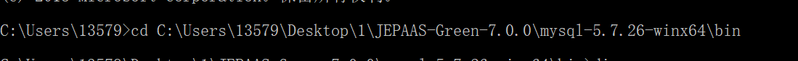
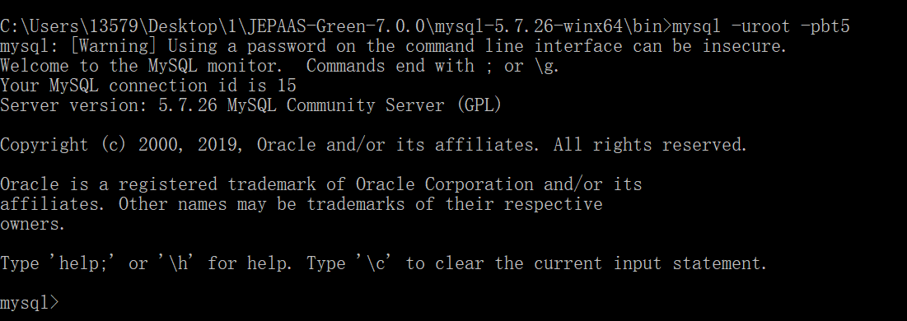
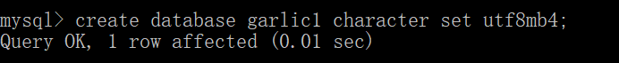
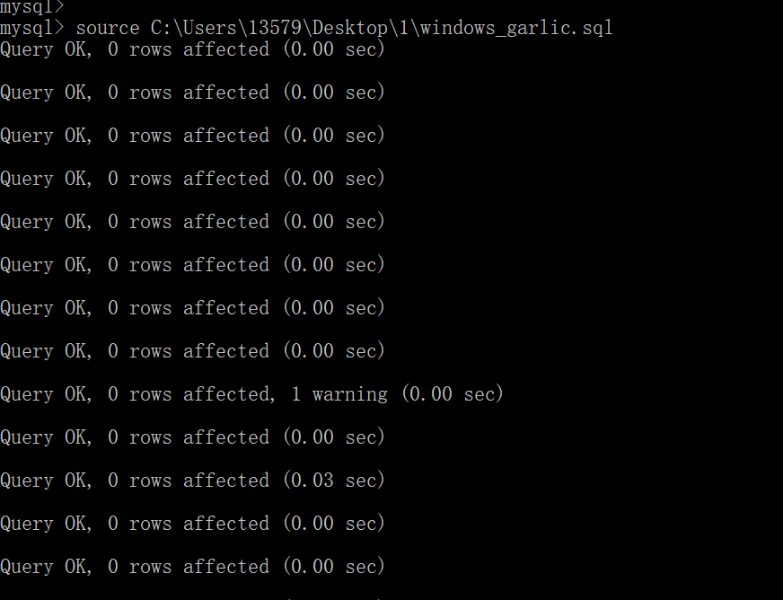
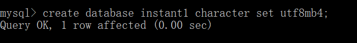
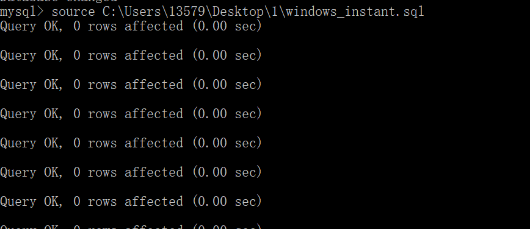

## MySQL初始化手册

> 本项目仅支持mysql5.7版本以上,字符编码支持utf8mb4

###JEPAAS项目导入数据库如下：

本实例演示从cmd命令行导入数据 

> 注意：本命令支持window10

进入cmd后输入chcp 65001 命令设置cmd支持utf8编码
```batch
chcp 65001
```

进入本机mysql命令行目录
    cd C:\Users\13579\Desktop\1\JEPAAS-Green-7.0.0\mysql-5.7.26-winx64\bin
如下图：


连接数据库
```batch
mysql -uroot -pbt5
```

如下图：



连接mysql后根据需求创建对应数据库，本实例使用garlic1(可以自行修改)

```batch
create database garlic1 character set utf8mb4
```

如下图：



选择数据库
```batch
use garlic1;
```    

在当前数据库中导入表(后面的路径是sql所在的路径)

```batch
source C:\Users\13579\Desktop\1\windows_garlic.sql
```
    
如下图：


### 推送项目导入数据库如下：

连接mysql后根据需求创建对应数据库，本实例使用instant1
```batch
create database instant1 character set utf8mb4;
```
    
如下图：



选择数据库
```batch
use instant1;
```
    
如下图：


在当前数据库中导入表(后面的路径是sql所在的路径)
```batch
source C:\Users\13579\Desktop\1\windows_instant.sql
```
    
如下图：


