**导入的前提是本机已经安装了java、maven等必要的开发工具**

1. 启动IDEA，选择 import Project（前提项目已经down到本地了，如果本地没有的话，就需要选第四项，点击，选择是svn还是git还是其他方式拉取代码）
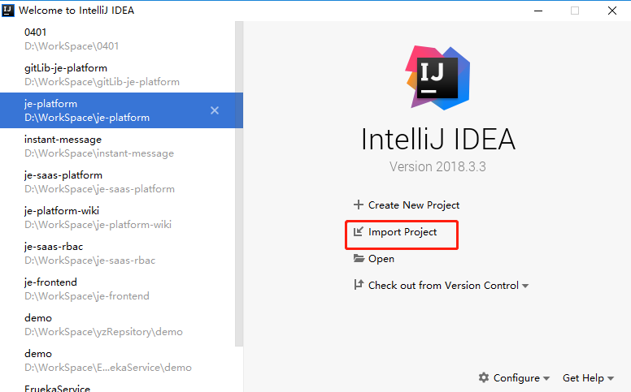

1. 选中要导入的项目后，选择 Maven，点击 Next，进入到下一页面
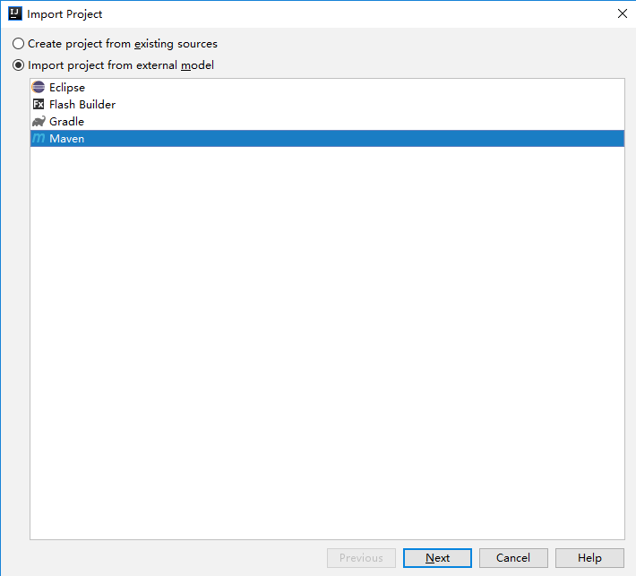
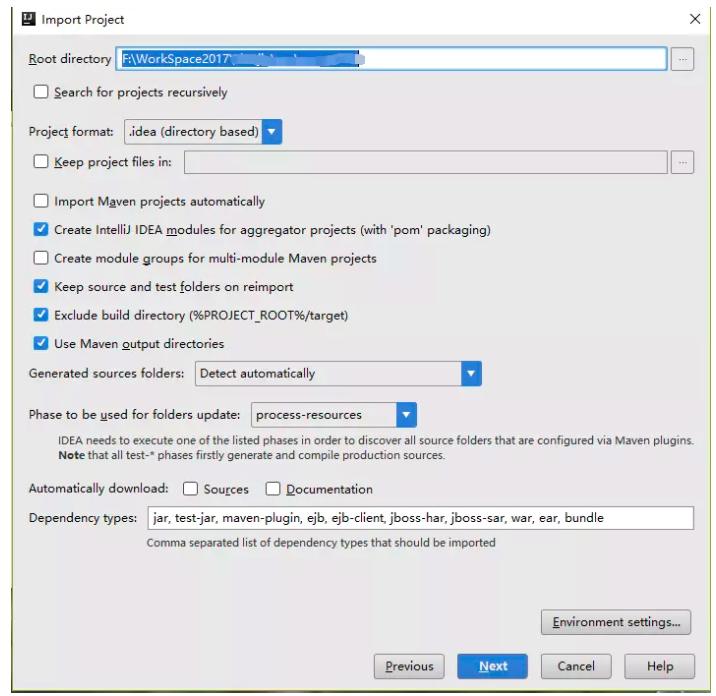

1. 继续点击下一步
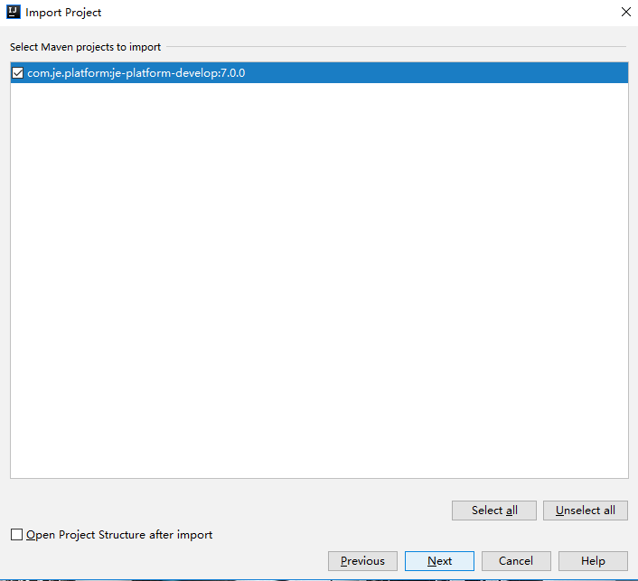
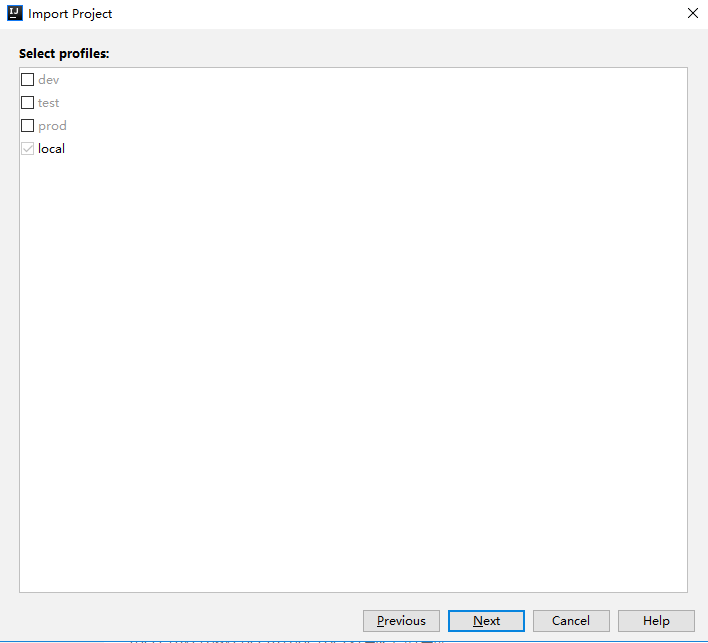

1. 点击加号、添加jdk
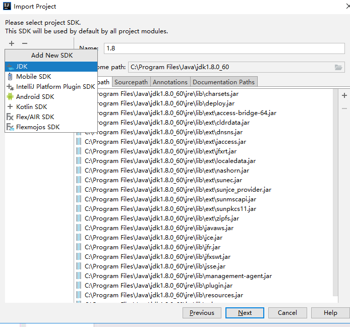

1. 填写项目名称、选择项目路径（一般默认就行），点击Finish
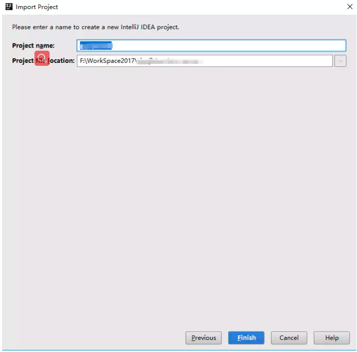

1. 等待一段时间后（这段时间是在加载项目），就会看到项目菜单了
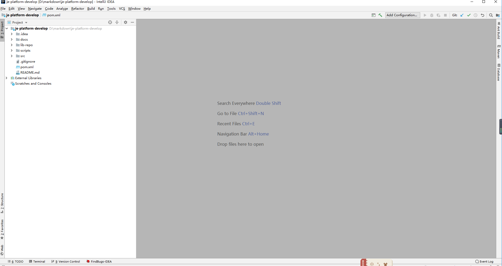
项目就导入完毕了，接下来是配置信息，让项目能够运行

1. 选择 File ---Settings
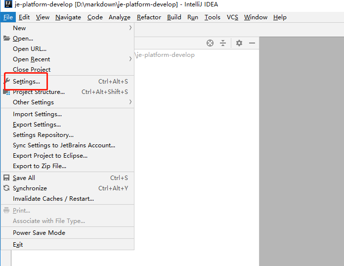

1. 搜索maven，按图中所示，配置maven，默认进来时候，划红线的第二、第三个是不能选的，将后面的两个选项框勾上以后，就能进行选择了，配置完以后，选择 Apply按钮
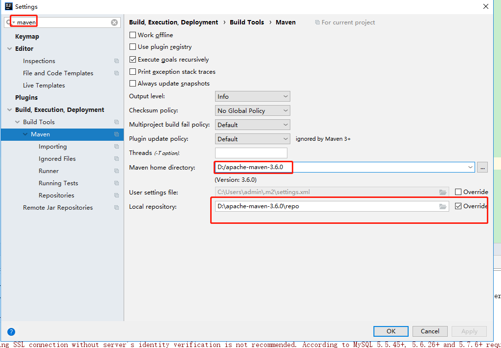

1. 关闭掉上面的Settings弹框，在主界面选择 View ---> Tool Windows ---> Maven 
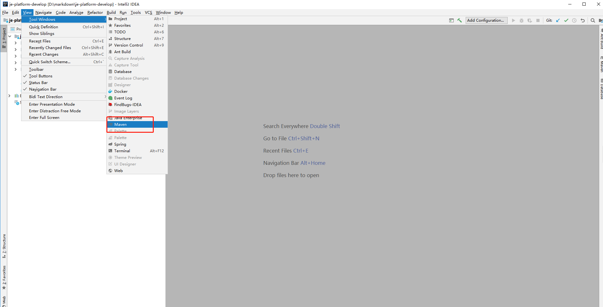

1. 屏幕的右侧（一般默认的就是在右侧）会出现下面这个信息，此刻，需要加载项目需要的包，如果是首次加载Maven项目的话，需要点击下载那个图标，这一步会有点慢；如果本地已经有项目所需的包，那点击刷新按钮就行，有时候，需要多点几次刷新，才能全部加载完毕。（项目所需包没加载完，项目下会有红线提示）
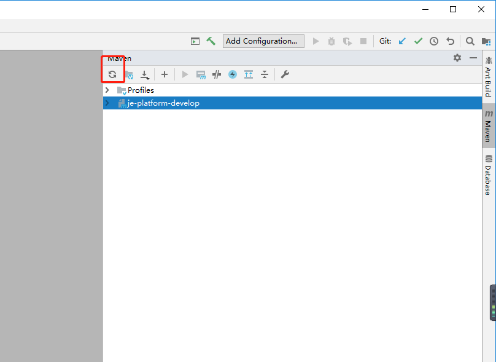

1. 至此，项目部署完毕。

1. 启动方式，找到JEApplication类，点击debug启动 
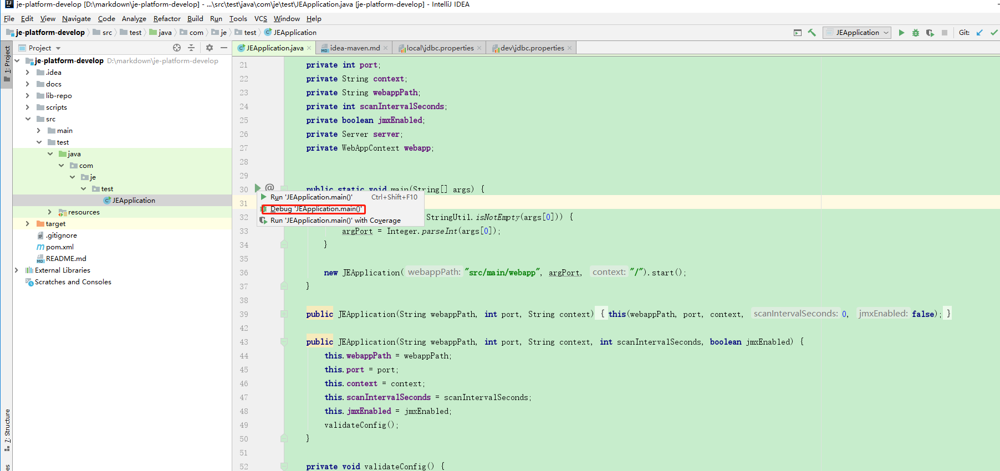
1. 如果启动有问题，检查maven中的配置文件，然后点击 clean成功后再点击package成功后  然后重新启动
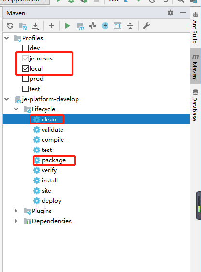

