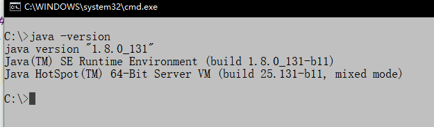
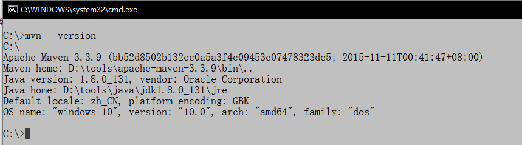

## 下载
进入[maven](https://maven.apache.org/download.cgi)下载页面, 下载[apache-maven-3.6.1-bin.zip](http://mirrors.tuna.tsinghua.edu.cn/apache/maven/maven-3/3.6.1/binaries/apache-maven-3.6.1-bin.zip)。

## 安装
- 确保已安装JDK，并配置好了JAVA环境
  检查 JAVA 是否安装正确，打开命令控制台   java -version
  
  
- 下载 Maven 的 zip 文件，将它解压到你要安装 Maven 的文件夹。
- 配置maven环境变量

## 验证
