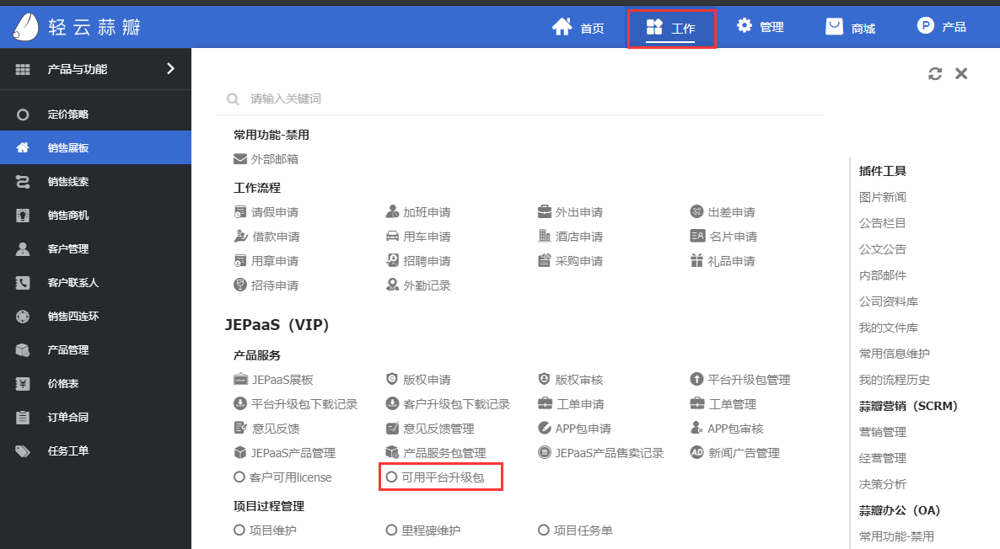
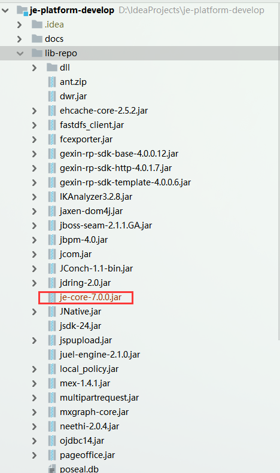
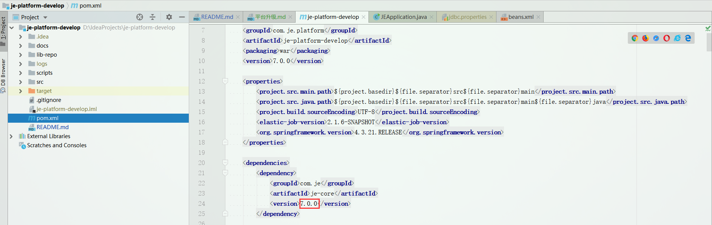
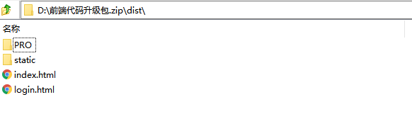
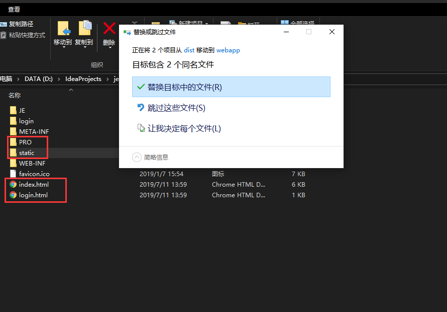

## 升级包下载


## 升级流程
- 查看升级版本说明，确认升级内容。
- 平台升级内容包含三部分，功能升级包、代码升级包、升级版本说明。
- 升级顺序: 先升级功能包，然后再升级代码包。


## 后端代码升级
- 使用后端代码包替换旧的je-core-7.0.0.jar, 建议保存旧的代码包，如果出现代码升级失败的情况，可以快速回滚。
    

- 修改pom.xml
    

- 使用maven重新打包，例： 生产环境打包 
```
mvn clean package -Pprod -Dmaven.test.skip=true
```

## 前端代码升级
- 解压前端代码包



- 如果修改过前端代码，请先备份
- 替换前端代码



- 在新代码中修改对应备份的内容


## 功能升级
