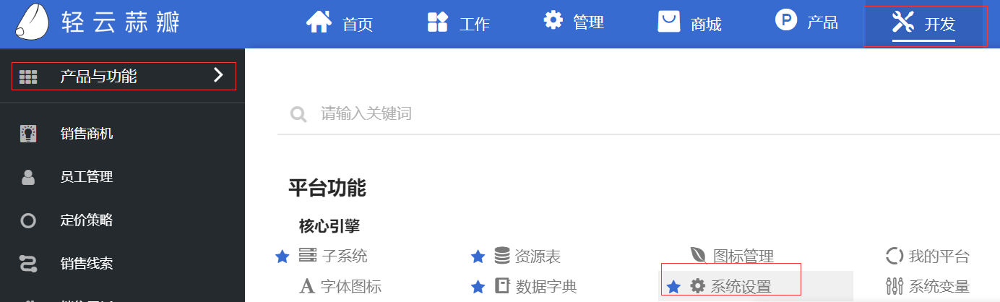
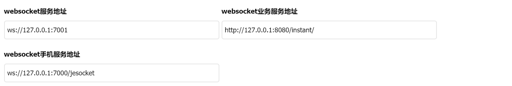

# 平台部署版启动配置手册

JEPaaS平台采用分离架构，分为JEPaaS应用服务，连接器服务和推送业务服务。用户部署时需要修改相应的数据库地址、Redis配置及连接配置。

## 服务配置

### 连接器服务配置

连接器配置主要包括原生WebSocket配置、SocketIO配置，Redis配置，jmx配置，缓存配置，业务配置。
配置文件为：<u>connector-server/application.conf</u>
连接器主要用于统一的Socket连接管理，采用多端口，统一连接管理器设计等，可以基于多端口形式，统一发送和接受消息，同时，方便集群横向扩展。

#### 原生WebSocket配置

原生WebSocket是基于Netty实现的原生WebSocke，在APP移动端，我们采用了此端口，此配置如下所示
```
    websocket {
            port=7000 #端口配置
            wsPath="/jesocket" #路径配置
    }
    
```

#### SocketIO配置

由于原生WebSocket的浏览器兼容问题，我们采用SocketIO的兼容方案，在PC端，我们采用了此端口，此配置如下所示：
```
    port:7001 # 端口配置
    origin:"http://localhost:8080" # 暂时不起效
```

#### Redis配置

连接器使用Redis做缓存存储和消息解耦，此配置如下所示
```
    redis {
            url:127.0.0.1, #IP地址
            port:6379, #端口
            password:123456, #密码
            timeout:2000, #超时设置
            database:0 #选定槽
    }
```

#### Jmx配置

jmx消息配置，如下所示
```
    jmx {
            topic:topic.im.msg
            type:redis
            enabled:true
    }
```

#### 缓存配置

缓存配置，如下所示
```
    cache {
            type:redis,
            enabled:true
    }
```

#### 业务配置

业务配置主要与推送或及时通讯应用服务的相关接口定义，如下所示

```
    jeplantform {
      jeServerUrl:"http://localhost:8080",
      transgerWithLogin:"/je/doAct/doAct/loadTx",
      pushCertStatus:"/je/login/btnLog/pushStatus",
    }
```

```
    business {
            instantServerUrl:"http://127.0.0.1:8088/instant",
            instantGetAllMsgUrl:"/instant/news/getNoReadNewsByUser",
            instantUpdateMsgStatusUrl:"/instant/news/updateNewsStatusByUser",
            instantAddMessageUrl:"/instant/news/addMessage",
            instantGetGroupDetailUrl:"/instant/group/getGroupDetail"
    }
```

### 推送服务配置

推送服务为SpringBoot项目，用户需要配置数据库和Redis，配置文件地址为：instant-push-server-1.0.0.RELEASE/application.yml
如下所示
```
    datasource:
    name: dataSource
    url: jdbc:mysql://127.0.0.1:3306/instant?useUnicode=true&autoReconnect=true&failOverReadOnly=false&useSSL=false
    driver-class-name: com.mysql.jdbc.Driver
    username: root
    password: bt5
    type: com.alibaba.druid.pool.DruidDataSource
```

```
    redis:
    timeout: 30s
    port: 6379
    password: 123456
    host: 127.0.0.1
    database: 0
    jedis:
      pool:
        min-idle: 50
        max-active: 200
        max-wait: 20s
        max-idle: 8
```

### JEPAAS应用服务配置


#### 推送配置
登录后，点击开发-->产品与功能-->系统设置



> 找到websocket服务地址，修改为socket服务ip地址和端口（修改为服务所在的ip和端口），当前设置为ws://127.0.0.1:7001
##### 找到websocket业务服务地址，修改为socket业务服务ip地址和端口（修改为服务所在的ip和端口），当前设置为127.0.0.1:8080
http://127.0.0.1:8080/instant/
> 找到websocket手机服务地址，修改为socket手机服务ip地址和端口（修改为服务所在的ip和端口），当前设置为ws://127.0.0.1:7000/jesocket

设置如下图
