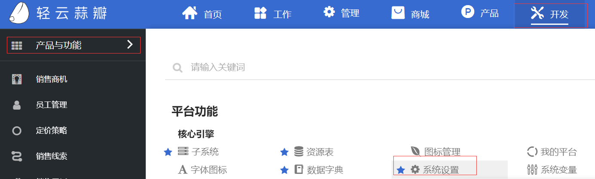
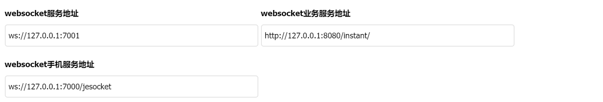

# JEPAAS绿色版安装部署手册（Linux Centos7版本）

## 平台介绍

> 欢迎您使用JEPAAS快速开发平台，JEPAAS的开发历经多个历史大版本的变更及发展，成功在多个行业应用及得到广大ISV及业务方的认可，我们将秉持初心，持续为业界提供能够快速开发的低代码开发平台，持续为您提供优质的产品和服务。
> JEPAAS绿色版为官方提供给用户的快速体验版本，用户可以根据文档快速启动JEPAAS并体验产品。

## 安装包说明

安装使用的各个服务版本说明：

* mysql：5.7  
* redis：4.0  
* tomcat：8.5  
* oracle-jdk：1.8

JEPaaS平台主要由JEPAAS应用服务，数据库服务，推送服务组成，所以我们在绿色版中提供了应用及数据库的快速启动方式，各服务列表如下所示

* JEPaaS应用服务，使用Tomcat作为应用容器，项目部署路径为/usr/local/tomcat/webapps/deployt，启动命令为<u>service tomcat start</u>
* 推送连接管理服务，使用Netty的NIO服务，项目部署路径为/data/connector-server，启动命令为<u>sh /data/connector-server/connector-server-1.0.0.RELEASE/bin/application.sh  start</u>
* 推送应用服务，使用SpringBoot内置Tomcat作为应用容器，项目部署路径为/data/instant-push-server，启动命令为<u>sh /data/instant-push-server/instant-push-server-1.0.0.RELEASE/springboot.sh  start</u>
* MySQL数据库服务，项目部署路径为/usr/local/mysql5.7，启动命令为<u>service mysqld start </u>
* Redis数据库服务，项目部署路径为/usr/local/redis，启动命令为<u>service redis start</u>

### 安装启动服务

将压缩包上传到Linux服务器，解压后,找到install.sh文件，执行方式 sh install.sh（以root用户启动）进行安装服务并且启动服务
（注意：不要使用中文目录存放程序，该脚本执行一次即可，大概需要10分钟左右）

    
### 服务的启动和关闭

> JEPAAS各服务之间是要求启动顺序的，用户需要按正确的顺序启动各模块，否则启动会造成相关服务不可用！
> 操作系统的相关端口不能被其他应用占用！

#### 启动顺序

1. 启动MySQL数据库服务命令： service mysqld start 
2. 启动redis服务命令：service redis start
3. 启动instant-push-server服务命令：sh /data/instant-push-server/instant-push-server-1.0.0.RELEASE/springboot.sh  start
4. 启动connector-server服务命令：sh /data/connector-server/connector-server-1.0.0.RELEASE/bin/application.sh  start
4. 启动jeplus服务命令：service tomcat start
    
> 注意：了解具体项目的配置和启动关闭，请参考具体项目介绍

#### 配置socket

登录后，点击开发-->产品与功能-->系统设置



1. 找到websocket服务地址，修改为socket服务ip地址和端口（修改为服务所在的ip和端口），本示例当前设置为127.0.0.1:7001
    ws://127.0.0.1:7001
2. 找到websocket业务服务地址，修改为socket业务服务ip地址和端口（修改为服务所在的ip和端口），本示例当前设置为127.0.0.1:8080
    http://127.0.0.1:8088/instant/
3. 找到websocket手机服务地址，修改为socket手机服务ip地址和端口（修改为服务所在的ip和端口），本示例当前设置为127.0.0.1:8080
    ws://127.0.0.1:7000/jesocket

    

##服务配置

### mysql服务

### 配置信息
* mysql版本：5.7
* 端口号：3306
* 配置文件路径：/etc/my.cnf
* 部署路径：/usr/local/msyql5.7

### 修改端口号

```bash
port = 需要修改的的端口号
```
    
#### 数据库信息介绍

```
连接数据库用户名：root 
密码：bt5
jeplus 使用的主库：garlic
IM 推送使用的主库：instant
```
      
####  启动方式

```bash
service myqld start
```
    
####  关闭方式

```bash
service myqld stop
```
    
  
###   redis服务

####  配置信息
* redis版本：4.0
* 端口号：6379
* 配置文件路径：/etc/redis.conf
* 部署路径：/usr/local/redis

####  修改端口号相关配置
* 配置文件：/etc/redis.conf
* redis auth：123456
* 修改绑定地址 bind 0.0.0.0

####  修改端口号
```
port 6379
```
      
####  修改auth
```
requirepass 123456
```
      
####  启动方式
```bash
service redis start
```
    
####  关闭方式
```bash
service redis stop
```
    
  
###  2.3 jdk

####   配置信息：
* jdk版本：oracle jdk1.8.0_191
* 安装地址：/opt/jdk1.8.0_191
  
###   JEPAAS项目配置

####  配置信息：

* tomcat版本：8.5
* tomcat端口号：8080 8085 8009
* tomcat安装目录：/usr/local/tomcat
* tomcat应用部署路径：/usr/local/tomcat/webapps/deploy
    
####  修改关闭端口号

```xml
<Server port="8005" shutdown="SHUTDOWN">
```
      
####  修改服务访问端口号

```xml
<Connector port="8080" protocol="HTTP/1.1"
                   connectionTimeout="20000"
                   redirectPort="8443" URIEncoding="GBK"/>
```
      
####  修改部署代码的配置路径

1. 配置文件路径：/usr/local/tomcat/webapps/deploy/WEB-INF/classes
mysql数据库配置文件：jdbc.properties
可以修改数据库连接地址，端口号，用户名和密码
```
jdbc.url=jdbc:mysql://127.0.0.1:3306/garlic?useOldAliasMetadataBehavior=true
jdbc.username=root
jdbc.password=bt5
```
      
2. redis配置文件：redis.properties
可以修改redis的host，端口号和auth
```
redis.host=127.0.0.1
redis.port=6379
redis.pass=123456
```
      
#####  启动方式
```bash
service tomcat start
```
    
#####  关闭方式
```bash
service tomcat stop
```
  
###  2.5 instant-push-server推送服务配置

推送服务为SpringBoot项目

####  配置信息

* 端口号：8088  
* 配置文件路径：/data/instant-push-server/instant-push-server-1.0.0.RELEASE/application.yml

修改端口号：
```
port: 8088
servlet:
context-path: /instant
```
      
####  修改数据库连接地址
```yaml
datasource:
        name: dataSource
        url: jdbc:mysql://127.0.0.1:3306/instant?useUnicode=true&autoReconnect=true&failOverReadOnly=false&useSSL=false
        driver-class-name: com.mysql.jdbc.Driver
        username: root
        password: bt5
        type: com.alibaba.druid.pool.DruidDataSource
```
      
####  启动方式

使用脚本方式
```bash
sh /data/instant-push-server/instant-push-server-1.0.0.RELEASE/springboot.sh  start
```

或者

```bash
sh springboot.sh  start
```

####  关闭方式

使用脚本关闭
```bash
sh /data/instant-push-server/instant-push-server-1.0.0.RELEASE/springboot.sh  stop
```
或者
```bash
sh springboot.sh  stop
```    


###  connector-server连接器服务配置
#### 配置信息：
* 端口号为：7000 7001
* 配置文件相对目录为：/data/connector-server/connector-server-1.0.0.RELEASE/lib/conf/application.conf

> 注意：您的计算机请不要占用这些端口，否则就会冲突。如果需要需要修改端口号或者其他的配置信息

#### 修改服务端口号
 
 原生WebSocket是基于Netty实现的原生WebSocke，在APP移动端，我们采用了此端口，此配置如下所示
 ```
 websocket {
     port=7000
     wsPath="/jesocket"
 }
 ```
    
 由于原生WebSocket的浏览器兼容问题，我们采用SocketIO的兼容方案，在PC端，我们采用了此端口，此配置如下所示：
 ```
 socketio {
     port:7001
     origin:"http://localhost:8080"
 }
 ```
    
 #### 修改Redis配置信息
 
 连接器使用Redis做缓存存储和消息解耦，此配置如下所示
 ```
 redis {
     url:127.0.0.1,
     port:6379,
     password:123456,
     timeout:2000,
     database:0
 }
 ```
    
 #### Jmx配置
 
 jmx消息配置，如下所示
 ```
     jmx {
             topic:topic.im.msg
             type:redis
             enabled:true
     }
 ```
 
 #### 缓存配置
 
 缓存配置，如下所示
 ```
     cache {
             type:redis,
             enabled:true
     }
 ```
 
 #### 业务通用配置,instant-push-server服务的地址和端口号修改的时候需要修改instantServerUrl的相应信息
 ```
 business {
     instantServerUrl:"http://127.0.0.1:8088/instant",  #该地址为instant-push-server服务的地址和端口号
     instantGetAllMsgUrl:"/instant/news/getNoReadNewsByUser",
     instantUpdateMsgStatusUrl:"/instant/news/updateNewsStatusByUser",
     instantAddMessageUrl:"/instant/news/addMessage",
     instantGetGroupDetailUrl:"/instant/group/getGroupDetail"
 }
 ```
      
####  启动方式：

```
sh /data/connector-server/connector-server-1.0.0.RELEASE/bin/application.sh  start
```
或者进入： /data/connector-server/connector-server-1.0.0.RELEASE/bin/目录
```
sh application.sh  start
```
    
####  关闭方式：
```
sh /data/connector-server/connector-server-1.0.0.RELEASE/bin/application.sh  stop
```

或者进入：/data/connector-server/connector-server-1.0.0.RELEASE/bin/目录
```
sh application.sh  stop
```
	
## 访问服务

1. http://localhost:8080/login.html
2. 登录用户名：13131059599
3. 登录密码：123456


## 社区服务

1. 官方讨论社区，[JE生态圈](http://jestq.com)
2. SAAS云及JEPAAS授权管理，[蒜瓣SAAS](https://suanbanyun.com)
3. JEPLUS介绍及演示，[JEPLUS官网](https://jeplus.cn)

## 联系我们

**电话**

* <u>010-82809807</u>
*  <u>400-0999-235</u>

* * *

**欢迎关注我们的微博**


  
  
  
 
 
  
  
  